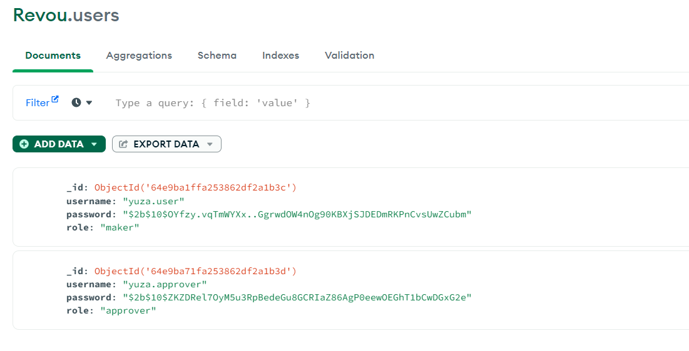

# Week 10 Assignment

The assignment is built using Node.js and Express.js, utilizing MongoDB for database operations and an OpenAPI specification for defining the API endpoints.

##Functionality:
**User Registration & Login:** The application allows users to register with two distinct roles: 'maker' and 'approver'. Users can choose their role during registration for login.

**Transfer List Retrieval:** Users, once logged in, can retrieve a list of all transfers.

**Transfer Creation:** Authenticated users, particularly those with the 'maker' & 'approver' role, can create new transfer requests.

**Transfer Approval/Rejection:** Users with the 'approver' role have the ability to review the pending transfers and either approve or reject them.

## Tools & Ingredients

- Node.js & Express.js
- Swagger UI
- Postman
- MongoDB

## Features
* Authentication
    - Register
    - Login to get JsonWebToken for authorization
* Transfer
    - Create a transfer (Role: all users)
    - List all transfer history (Role: all users)
    - Update transfer status [Approve / Reject] (Role: Approver)

**Available Account**
```
{
    "username" : "yuza.user",
    "password" : "yuza1234",
    "role" : "maker"
}
```
```
{
  "username": "yuza.approver",
  "password": "yuza1234"
  "role": "approver"
}
```
## API Endpoints
| Name                                | HTTP Methods| EndPoints                 | 
|-----------------------|-------------|-------------|---------------------------|
|**Register User**                    |`POST`       |/auth/register             |
| **Login User**                      | `POST`      | /auth/login               |
| **List All Transfer**               | `GET`       | /transfers/               |
| **Create Transfer**                 | `POST`      |/transfers/money           |
| **Update Transfer Status by ID**    | `PATCH`     |/transfers/{transferId}    |

## MongoDB User List

## MongoDB Transfer List


## Swagger UI


## OpenAPI Documentation & Router


## Deployment
Deployment link here [https://courageous-hen-houndstooth.cyclic.cloud/api-docs](https://courageous-hen-houndstooth.cyclic.cloud/api-docs)
## Contact Person
[](https://www.linkedin.com/in/alyuzasp/) [](https://www.youtube.com/@alyuza/about) [](https://www.instagram.com/alyuuza/)